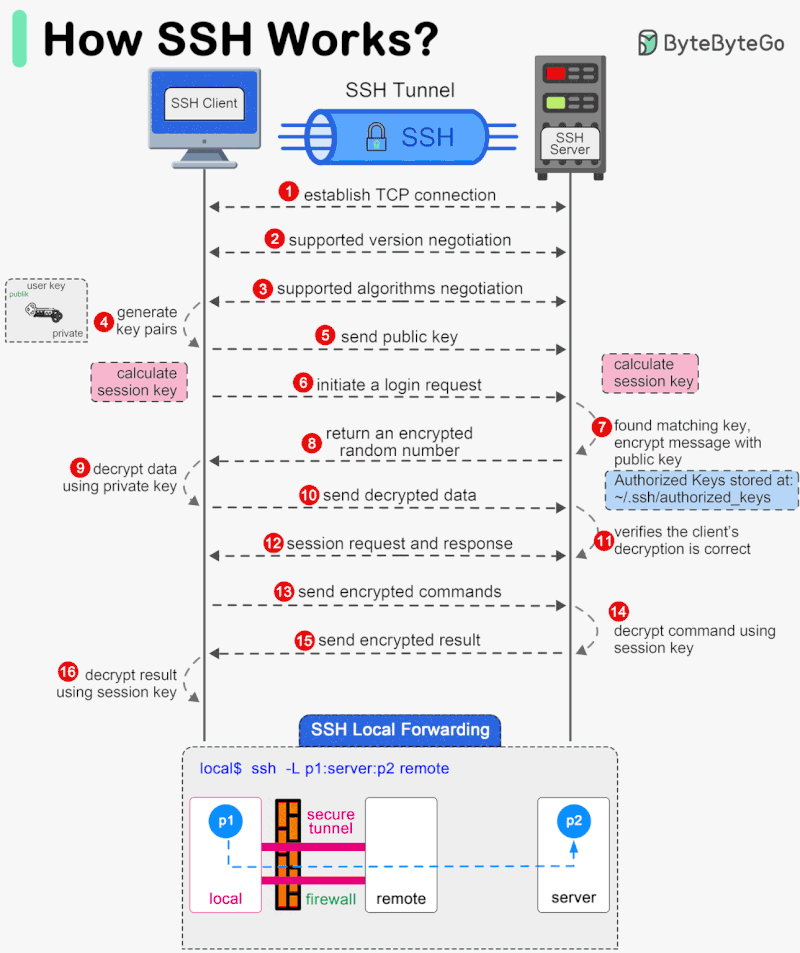

# SSH Key Benefits, Commands, Tools, and Best Practices

## SSH Key Benefits 🎉



### 1️⃣ Security 🔒
SSH provides robust security features, including:
- **Encryption**: Ensures all data exchanged is secure.
- **Authentication**: Uses public-key authentication to prevent unauthorized access.
- **Access Control**: Restricts access to specific users and IP addresses.

### 2️⃣ Flexibility 🌈
SSH allows remote access to servers from various devices and operating systems, enabling:
- **Cross-platform compatibility** (Linux, macOS, Windows).
- **Port forwarding and tunneling** for secure data transfers.
- **Remote command execution** to manage systems effectively.

### 3️⃣ Efficiency 💸
SSH enables:
- **Secure file transfers** (SCP & SFTP).
- **Automated administration tasks** with SSH keys and scripts.
- **Tunneling for secure access** to restricted networks.

---

## SSH Commands 📝
Here are some commonly used SSH commands:

| Command | Description |
|---------|-------------|
| `ssh user@remote_host` | Establishes a secure connection to a remote server. |
| `scp file user@remote_host:/path` | Securely copies files between local and remote systems. |
| `sftp user@remote_host` | Securely transfers files using the SFTP protocol. |
| `ssh-keygen -t rsa -b 4096` | Generates a new SSH key pair. |
| `ssh-copy-id user@remote_host` | Copies your public key to the remote server for authentication. |
| `ssh -L local_port:remote_host:remote_port user@remote_host` | Sets up SSH tunneling. |
| `ssh -i /path/to/private_key user@remote_host` | Connects using a specific private key. |

---

## SSH Tools 🛠️
Popular SSH tools and clients:

- **OpenSSH**: A widely used, open-source SSH implementation.
- **PuTTY**: A popular SSH client for Windows.
- **MobaXterm**: An advanced SSH client with multiple features.
- **Termius**: A cross-platform SSH client with a user-friendly interface.
- **WinSCP**: A Windows tool for SFTP and SCP transfers.

---

## SSH Best Practices 📚
Follow these best practices for secure SSH access:

### 1️⃣ Use Public Key Authentication 🔑
- Disable password authentication and use SSH keys.
- Run: `ssh-keygen -t rsa -b 4096` to generate a secure key pair.

### 2️⃣ Disable Root Login 🚫
- Edit `/etc/ssh/sshd_config` and set:
  ```plaintext
  PermitRootLogin no
  ```

### 3️⃣ Change Default SSH Port 🔢
- Modify the SSH port in `/etc/ssh/sshd_config`:
  ```plaintext
  Port 2222
  ```

### 4️⃣ Enable Firewall & Fail2Ban 🛡️
- Use `ufw` on Ubuntu:
  ```bash
  sudo ufw allow 2222/tcp
  sudo ufw enable
  ```
- Install Fail2Ban:
  ```bash
  sudo apt install fail2ban
  ```

### 5️⃣ Regularly Update SSH Software 📈
- Keep SSH updated to patch vulnerabilities:
  ```bash
  sudo apt update && sudo apt upgrade -y
  ```

---

## SSH Common Issues 🚨

| Issue | Solution |
|---------|-------------|
| **Connection Refused** | Ensure the SSH service is running: `sudo systemctl restart ssh` |
| **Authentication Failed** | Verify the username, password, or key file. |
| **Permission Denied** | Ensure correct file permissions (`chmod 600 ~/.ssh/id_rsa`). |
| **SSH Timeout** | Increase the `ClientAliveInterval` in `/etc/ssh/sshd_config`. |

---

## Additional Security Enhancements 🔐
- **Enable Two-Factor Authentication (2FA)** for SSH login.
- **Restrict SSH access by IP** using firewall rules.
- **Monitor login attempts** with `last` and `auth.log`.

---

## Conclusion 🎯
SSH is a powerful tool for secure remote access and system management. Following best practices ensures strong security and efficiency in managing remote systems.

---

## Author ✍️
**Created by:** Kris Armstrong

For more details, refer to the [OpenSSH Documentation](https://www.openssh.com/manual.html).
